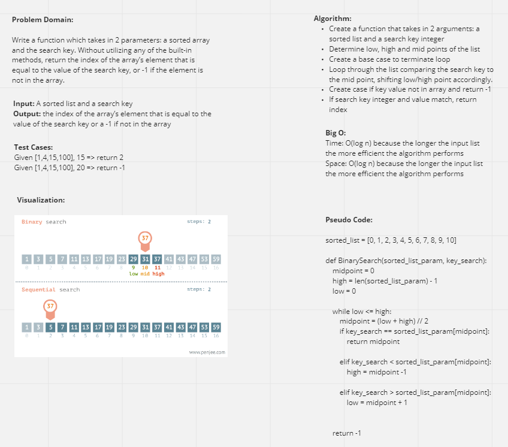

# Binary Search an Array
Define a function that accepts an assorted list and key search term as arguments and returns the
index of the matching value or -1 if not found

## Whiteboard Process

## Approach & Efficiency
We created a function to take in a sorted array and key argument to run a binary search on it because
it is already sorted. Binary searches are vastly more efficient than sequential searching as the
length of the list grows due to how logarithms work mathematically. By updating a low and high
variable to essentially bisect the list and search from there, we can search a list of 64 values
in at most 6 iterations.

Time and Space is O(Log N) because it's a logarithmic equation.

## Partner
Sergii Otryshko
